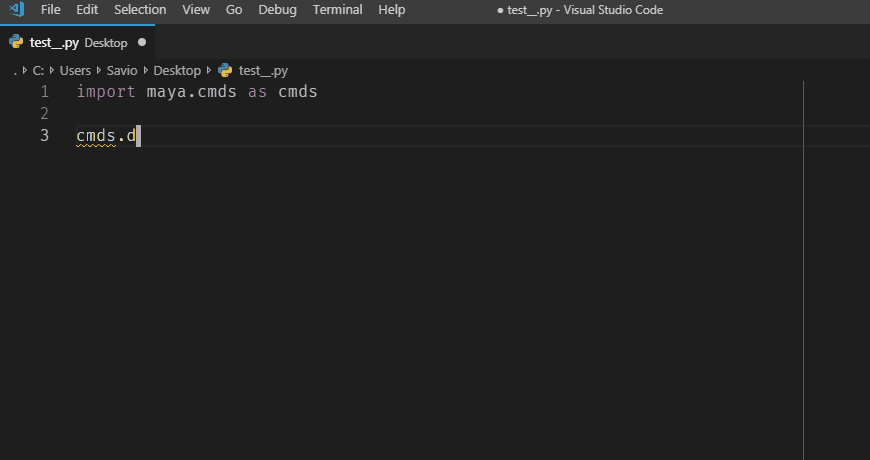

# Maya Python Completions for Visual Studio Code

These are some stubs files that assist vscode via jedi in autocompleting commands used in the Maya Python codebase.

> 

## How to use

* Clone this repo to a local folder on disk. (eg `/home/savio/vscode/maya-completion`)

* In your vscode `settings.json` add this local path as a autoComplete extraPath 

  ```
  "python.autoComplete.extraPaths": ["/home/savio/vscode/maya-completion"]
  ```

## Known Issues

If your using the python language server and python 2.7, there seems to be a bug in vscode-python
that doesn't show docstrings correctly.

Read more about it here:

Intellisense not showing docstrings from /lib/site-packages modules in Python 2.7 virtual env [#2989](https://github.com/Microsoft/vscode-python/issues/2989)
https://github.com/Microsoft/vscode-python/issues/2989

## Requirements

* [Visual Studio Code](https://code.visualstudio.com/)
* [Microsoft Python extension](https://marketplace.visualstudio.com/items?itemName=ms-python.python)
